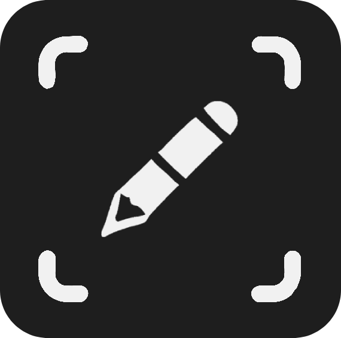

<sub>README.md</sub>

<p align="center" style="margin: 40px 0px 30px">
  
</p>

<h1 align="center">
  Collaborative Code Editing
</h1>

A collaborative code editor built using [Monaco Editor](https://microsoft.github.io/monaco-editor/) and [Automerge](https://automerge.org/). Supports multiple users editing the same document simultaneously, with features like real-time synchronization, offline editing, and cursor/selection sharing.

<p align="center">
  
</p>

## Key Features

- Real-time collaborative editing with multiple users.
- Cursor and selection sharing between users.
- Peer-to-peer and WebSocket-based synchronization.
- Offline support with local changes synchronization once the connection is restored.
- Revert to snapshot hash functionality.

## Getting Started

Follow these instructions to get a copy of the project up and running on your local machine for development and testing purposes.

### Prerequisites

Make sure you have [Docker](https://www.docker.com/products/docker-desktop) installed on your machine and running.

### Installation

1. Clone the repository:
    ```sh
    git clone https://github.com/jernejc/qawolf-collab-editor
    cd qawolf-collab-editor
    ```

2. Start the application using Docker Compose:
    ```
    docker-compose up --build
    ```

This will start both the client and server containers.

## Usage

1. Open the application in your browser. By default, it will run on `http://localhost:8080`.
2. **Copy the URL** and open it a new tab to start collaborating in real-time.
3. Example url:
    ```
    [host]/automerge:336uk9sp24iLqxcgi5k7BvV48a9f
    ```
4. Link to snapshot with undo/redo option:
    ```
    [host]/automerge:336uk9sp24iLqxcgi5k7BvV48a9f/[stateHash]
    ```

## Run Tests

### e2e tests

Make sure docker-compose is running **all containers**.

Run in `tests` folder:
  ```
  npm run setup
  npm run test
  ```
### Client & Server specific tests

Make sure you have **all depedencies** installed.

Run unit and integration tests from the `client` or `server` folder:
  ```
  npm install
  npm run test
  ```

## Relevant Projects

- [Automerge Repo](https://github.com/automerge/automerge-repo)
- [Automerge Repo React Hooks](https://github.com/automerge/automerge-repo/tree/main/packages/automerge-repo-react-hooks)
- [Automerge Prosemirror](https://github.com/automerge/automerge-prosemirror)
- [Automerge Repo Sync Server](https://github.com/automerge/automerge-repo-sync-server)
- [Monaco Editor](https://github.com/microsoft/monaco-editor)
- [Monaco Collab Ext](https://github.com/convergencelabs/monaco-collab-ext/)
