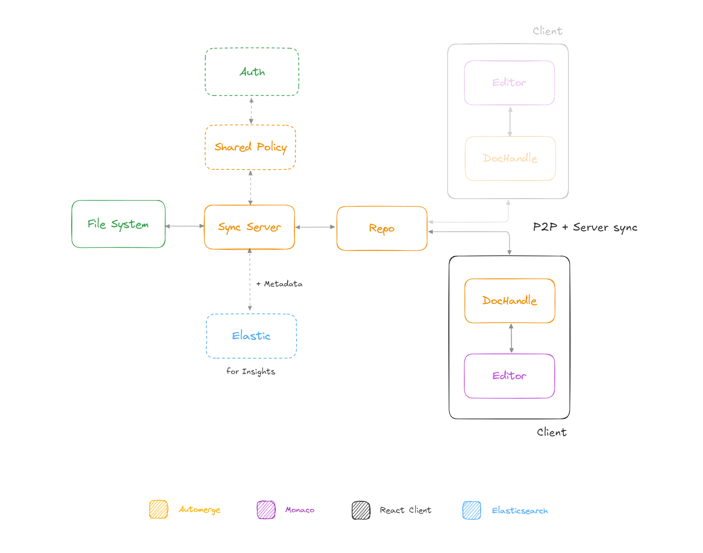

<sub>architecture.md</sub>

<p style="margin:10px 0px">
  <a target="_blank" href="https://excalidraw.com/#json=yww6Aapyn22A3YcXSkZnB,VrvnMYpapUYH1CQpCRJEFg">
    https://excalidraw.com/#json=yww6Aapyn22A3YcXSkZnB
  </a>
  <picture>
    <source media="(prefers-color-scheme: dark)" srcset="../assets/diagram-dark.png">
    
  </picture>
</p>

<h1 align="center" style="margin: 15px 0px">
Architecture
</h1>

This document outlines the architecture of Wolf Editor. It provides an overview of the current features, key components, third-party libraries used, and potential future enhancements.

## Key Components

- [Sync Server](#sync-server)
- [Automerge Repo](#automerge-repo)
- [React Client](#client)
- [Shared Policy & Auth (*)](#shared-policy)
- [Elasticsearch (*)](#elastic)

<h3 id="sync-server">Automerge Sync Server</h3>

- Syncs document changes between connected clients and the server.
- Persists document data into the file system for durability.
- Syncs document history and changes to [Elasticsearch](https://www.elastic.co/guide/en/elasticsearch/reference/current/index.html) for insights. (*)
- Integrates with a third-party authentication service to enforce access control policies. (*)
- [Automerge Repo Sync Server](https://github.com/automerge/automerge-repo-sync-server)

<h3 id="automerge-repo">Automerge Repo</h3>

- Facilitates communication between the sync server and connected clients (also peer-to-peer).
- Currently using the following **networks adapters**: 
  - [BroadcastChannelNetworkAdapter](https://github.com/automerge/automerge-repo/tree/main/packages/automerge-repo-network-websocket)
  - [BrowserWebSocketClientAdapter](https://github.com/automerge/automerge-repo/tree/main/packages/automerge-repo-network-websocket)
- [File storage Adapter](https://github.com/automerge/automerge-repo/tree/main/packages/automerge-repo-storage-nodefs)
- [Automerge Repo](https://github.com/automerge/automerge-repo)

<h3 id="client">React Client</h3>

- Implements [Monaco Editor](https://microsoft.github.io/monaco-editor/) for code editing.
- Handles peer-to-peer and server synchronization via [Automerge Repo](https://github.com/automerge/automerge-repo).
- Handles local and remote cursor/selection awareness.
- [Automerge Repo React hooks](https://github.com/automerge/automerge-repo/tree/main/packages/automerge-repo-react-hooks)
- [@monaco-editor/react](https://github.com/suren-atoyan/monaco-react)
- [Redux toolkit](https://redux-toolkit.js.org/) for global state management
- [React router](https://reactrouter.com/en/main) for routing

For client side tests run (**make sure you have all the depedencies installed**):
```sh
  npm run test
```

## Offline Support and Merging Changes

**Automerge's CRDT** based synchronization allows local changes to be made even when offline. Changes are synchronized with other peers once the connection is re-established. Conflicts and concurrent writes are handeled automatically, ensuring a consistent document state across all clients.

- [Merge Rules](https://automerge.org/docs/under-the-hood/merge_rules/)
- [The Storage Model](https://automerge.org/docs/under-the-hood/storage/#the-storage-model)
- [updatetext](https://automerge.org/docs/documents/text/#using-updatetext-when-you-cant-use-splice)
- [CRTD](https://crdt.tech/)

### Scaling and resource management (*)

At this stage, scaling of the servers can be delegated to a managed service like [Cloud Run](https://cloud.google.com/run?hl=en), where we can control and dynamically scale the number of containers running at a given time. Similarly, we can control the amount of requests each container would process.

## e2e Tests

[Playwright](https://playwright.dev/) is used for end-to-end testing. The setup includes a few test scenarios to ensure that the editor works correctly across different browsers and scenarios.

## Future Enhancements

- **CI/CD workflows (GH Actions)**: Run Playwright tests with the docker setup. Automatically deploy if checks are OK.
- **User ACL**: Keep track of user roles, permissions, document access.
- **Cloud storage (S3, GCS)**: Automerge Repo storage adapter for known Cloud providers.
- **Transpile and bundle Typecript**: Currently Docker runs [Vite](https://vitejs.dev/) dev server, Typescript needs to be transpiled and bundled into JS.
- **Unit tests**: Both server and client require some units to be tested more thoroughly.

<h2 id="shared-policy">Shared Policy and Authentication (*Not implemented)</h3>

Automerge **Shared Policy** can be used to control which document can shared with other peers. The share policy will not stop a document being requested by another peer by its DocumentId. 

User authentication and document access level can be handled by a 3rd party service ([Firebase](https://firebase.google.com/docs/auth), [0Auth](https://auth0.com/)) or self-hosted and managed with something like [Keycloak](https://www.keycloak.org/).

- User ID <> Peer ID (used by Automerge)
- [Automerge Repo Share Policy](https://github.com/automerge/automerge-repo/tree/main/packages/automerge-repo#share-policy)
- https://automerge.org/automerge-repo/types/_automerge_automerge_repo.SharePolicy.html

<h2 id="elastic">Elasticsearch (*Not implemented)</h3>

Automerge prioritizes document size and compression, thus removing all metadata regarding individual changes. Elasticsearch can be used to store document change logs, including user and other metadata. This provides in-depth insights and analytics for documents and users.

Example queries:

``` javascript

{
  "query": {
    "range": { // limit agg results for specific time period
      "createdAt": {
        "gte": "now-1y",
        "lte": "now/d"
      }
    },
    "term": { // limit agg results to specific user
      "user": [myusername]
    }
  },
  "size": 0,
  "aggs": {
    "updates_per_month": {
      "date_histogram": { // aggregate update counts per month
        "field": "updatedAt",
        "calendar_interval": "month"
      },
      "aggs": {
        "documents": { // nested agg for update counts per document
          "terms": {
            "field": "documentID"
          }
        }
      }
    }
  }
}
```

[Date Histogram Docs](https://www.elastic.co/guide/en/elasticsearch/reference/current/search-aggregations-bucket-datehistogram-aggregation.html)